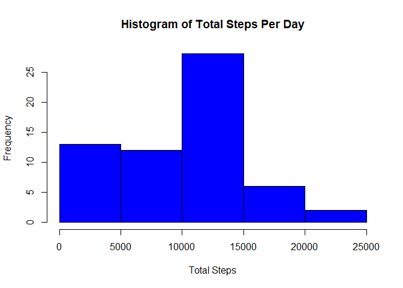
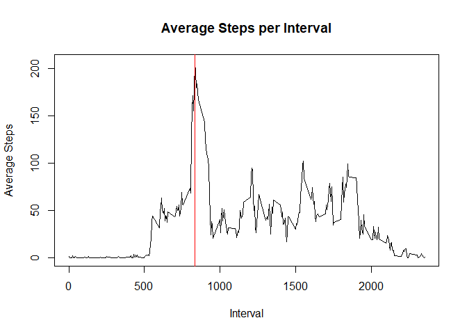
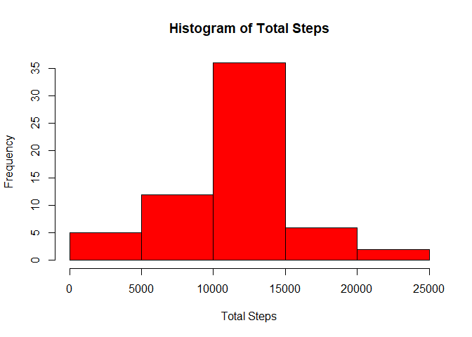
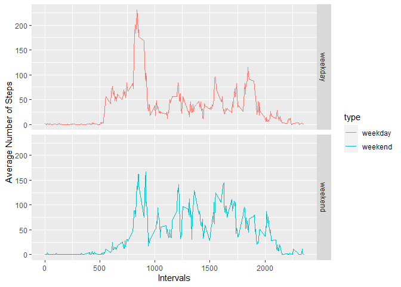

### Loading and preprocessing the data

Read the data and transform date to date format:

```r
data <- read.csv("activity.csv", na.strings = "NA")
data <- mutate(data, date = as.Date(date, format = "%Y-%m-%d"))
```

### What is mean total number of steps taken per day?

Calculating the mean, median and total steps taken per day
and plotting a histogram of the total steps per day:

```r
totalsteps <- data %>%
    group_by(date) %>%
    summarise(total_steps = sum(steps, na.rm = TRUE))
with(totalsteps, hist(total_steps, col = "blue",xlab = "Total Steps", main = "Histogram of Total Steps Per Day"))
```

<!-- -->

```r
meantotalsteps <- as.integer(mean(totalsteps$total_steps, na.rm = TRUE))
mediantotalsteps <- median(totalsteps$total_steps, na.rm = TRUE)
```
The mean is: 9354   
The median is:  10395  

### What is the average daily activity pattern?

```r
averageintervals <- data %>%
    group_by(interval) %>%
    summarise(meansteps = mean(steps, na.rm = TRUE))
with(averageintervals, plot(interval, meansteps, type ="l", xlab = "Interval", ylab = "Average Steps", main = "Average Steps per Interval"))
with(averageintervals, abline(v = interval [meansteps == max(meansteps)], col = "red"))
```

<!-- -->

```r
maxstepsinterval <- with(averageintervals, interval [meansteps == max(meansteps)])
```


As can be seen from the graph, the interval that contains the maximum number of steps is: 835th interval

### Imputing missing values
Calculating the missing

```r
missing <-sum(is.na(data$steps))
```
The total number of missing values in the data set: 2304

Replace missing values with the mean for that interval and create a new data set with the changed values:

```r
intervalmean <- data %>%
    group_by(interval) %>%
    summarise(meansteps = mean(steps, na.rm = TRUE))
data2 <- read.csv("activity.csv", na.strings = "NA")
data2 <- mutate(data2, date = as.Date(date, format = "%Y-%m-%d"))
for (i in 1:length(data2$steps)){
    if (is.na(data2$steps[i])){
        data2$steps[i] = intervalmean[intervalmean$interval == data2$interval[i],]$meansteps
    }
}
```

Histogram, mean and medians of total steps each day of the new data set:

```r
totalsteps2 <- data2 %>%
    group_by(date) %>%
    summarise(total_steps = sum(steps))
with(totalsteps2, hist(total_steps, col = "red", xlab = "Total Steps", main = "Histogram of Total Steps"))
```

<!-- -->

```r
meantotalsteps2 <- as.integer(mean(totalsteps2$total_steps))
mediantotalsteps2 <- as.integer(median(totalsteps2$total_steps))
```
The mean is: 10766   
The median is:  10766  
When we compare these values with data that didn't impute the missing values(mean = 9354, median = 10395 ), we see that the mean and median total steps increased for the imputed missing values.And these results are less biased that simply ignoring the NAs. 


### Are there differences in activity patterns between weekdays and weekends?


```r
wd <- c("Monday", "Tuesday", "Wednesday", "Thursday", "Friday")
wend <- c("Saturday", "Sunday")

for (i in 1:nrow(data2)){
    if(weekdays(data2$date[i]) %in% wd){
        data2$type[i] <- "weekday"
    }
    else if (weekdays(data2$date[i]) %in% wend){
        data2$type[i] <- "weekend"
    }
}

meanbydays <- aggregate(steps ~ interval + type, data2, mean)
g <- ggplot(meanbydays, aes(interval, steps, color = type))+
    geom_line()+
    facet_grid(type~.)+
    xlab("Intervals")+
    ylab("Average Number of Steps")
print(g)
```

<!-- -->


As can be seen from the graph, the maximum average steps is higher for weekdays(above 200 compared to slightly above 150), but throughout the other intervals, the average steps are higher for weekend(around 125) compared to the weekday(around 75-100). 


